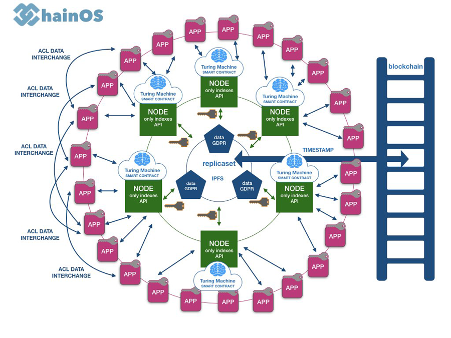

# ChainOS 
Privacy by Design Blockchain Enabler

ChainOS is a "multi-layer" decentralized platform to help businesses and public administrations to build GDPR compliance solutions
integrated with blockchain technologies.

# Project Status
Version: Alpha 0.0.1

This project is experimental and is not ready for public use. We are working on protocols and node structure testing many solutions and alternatives.

If you are a developer and want contribute to ChainOS, please contact [Gian Angelo Geminiani](https://gianangelogeminiani.me/).

# Architecture

# Dependencies
ChainOS has been initially developed by Gian Angelo Geminiani using its Open Source  [lyj framework](https://bitbucket.org/angelogeminiani/lyj/src/master/)

# Support
For support contact us on our [Telegram Group](https://t.me/joinchat/AO9yak9m31UlJy7uFWZoMQ)

# License
ChainOS is distributed under MIT License for personal, governament, education and no-profit use.

# SPECIAL MENTION

This project has been developed and supported by [Jetbrains Open Source License Program](https://www.jetbrains.com/community/support/#section=open-source).

Thanks to [Jetbrains](https://www.jetbrains.com/) for the great tools made available to us.
